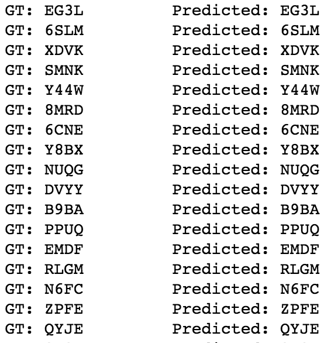

# Captcha Cracker
Captcha is still widely used as an authentication system in many places. But how secure is it? And can Machine Learning break it?

This project aims at building a captcha cracker. On a high-level overview, this will be divided into three parts:
* Feature Extraction from captcha image
* Running an RNN on the extracted feature
* Training using `CTC` as the loss function

Some of the sample results produced by the network are shown below:

